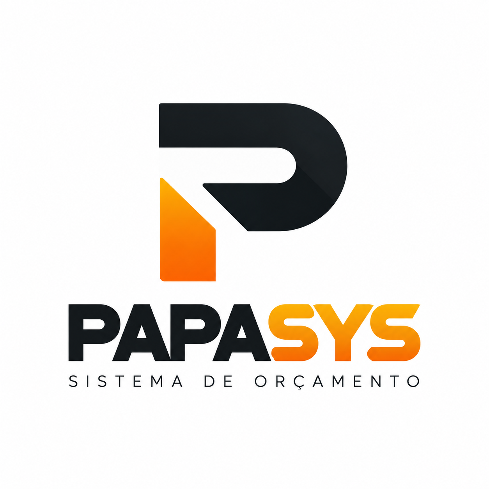

# PapaSys - Sistema de Paginação Inteligente e Orçamentos de Piscinas

<p align="center">
  
</p>

O **PapaSys** é um ecossistema integrado projetado especificamente para projetistas e construtores de piscinas. Ele une a modelagem 3D no **SketchUp** ao motor financeiro e de gestão comercial na **Web com Supabase**.

---

## 🏗️ Arquitetura do Sistema

```
PapaSys/
├── LogoSite.png                      # Logotipo oficial da marca PapaSys
├── supabase_schema.sql               # Script SQL pronto para rodar no Supabase
├── sketchup_plugin/                  # Código-fonte da extensão do SketchUp
│   ├── papasys_paginacao.rb          # Ficheiro raiz carregador (SketchupExtension)
│   ├── build_rbz.ps1                 # Script PowerShell para compilar o pacote .rbz
│   └── papasys_paginacao/
│       ├── __init__.rb               # Bootstrapper dos módulos e menus
│       ├── version.rb                # Controle de versão (ex: 1.0.0)
│       ├── config.rb                 # Configurações do Supabase e preferências
│       ├── updater.rb                # Auto-Updater silencioso nativo no SketchUp
│       ├── geom_engine.rb            # Algoritmo de snap modular centralizado e quantitativos
│       ├── api_client.rb             # Emissor HTTP direto para o Supabase
│       ├── ui_dialog.rb              # Janela nativa HtmlDialog
│       └── html/                     # Interface do plugin em HTML5/CSS3/JS
├── sistema_web/                      # Sistema Web 100% em HTML, CSS e JS puro
│   ├── index.html                    # Dashboard Kanban & Estatísticas em tempo real
│   ├── orcamento.html                # Editor detalhado e calculadora de margem (BDI)
│   ├── proposta.html                 # Proposta Comercial Executiva formatada para PDF
│   ├── precos.html                   # Gestão de Tabela Base de Custos e Insumos
│   ├── css/style.css                 # Estilos visuais Graphite & Orange do PapaSys
│   ├── js/
│   │   ├── config.js                 # Credenciais do Supabase
│   │   ├── supabase.js               # Conexão com banco e escuta Realtime
│   │   ├── calculator.js             # Fórmulas de consumo, quebra e precificação
│   │   ├── kanban.js                 # Controlador do painel Kanban
│   │   ├── orcamento.js              # Controlador do editor de orçamento
│   │   ├── proposta.js               # Controlador da proposta executiva e impressão
│   │   └── precos.js                 # Controlador da tabela de preços
│   ├── img/LogoSite.png              # Logo integrado
│   └── plugin/
│       ├── papasys_paginacao.rbz     # Pacote pronto para instalação no SketchUp
│       └── version.json              # Endpoint estático de auto-atualização
└── README.md
```

---

## 🏊‍♂️ Módulo 1: Plugin SketchUp (`sketchup_plugin/`)

### Como Instalar no SketchUp:
1. Abra o SketchUp.
2. Acesse o menu superior: **Extensões > Gestor de Extensões** (ou *Window > Extension Manager*).
3. Clique no botão azul **Instalar Extensão** (*Install Extension*).
4. Selecione o arquivo: `PapaSys/sistema_web/plugin/papasys_paginacao.rbz`.
5. Pronto! Uma nova barra de ferramentas chamada **PapaSys Paginação** e o menu **PapaSys Paginação** aparecerão automaticamente.

### Funcionalidades do Plugin:
* **Snap Geométrico Centralizado:** Encontra o centro exato da piscina (`bounds.center`) e atrai as faces para a grelha modular da pastilha (ex: 10x10cm, 15x15cm, 20x20cm + rejunte), **eliminando completamente os recortes de cantos e tiras estreitas**.
* **Quantitativos Precisos:**
  * **Área Interna ($m^2$):** Lê todas as faces internas e calcula a metragem exata para revestimento.
  * **Perímetro da Borda ($m$ linear):** Identifica as arestas abertas do topo da piscina para quantificar pedras atérmicas ou porcelanatos de borda.
* **Auto-Atualização Silenciosa:** O módulo `updater.rb` consulta periodicamente a versão mais recente. Quando uma nova versão é publicada, ele faz o download do `.rbz` e executa `Sketchup.install_from_archive` diretamente, mantendo todos os computadores da equipe atualizados sem reinstalação manual!
* **Disparo para a Nuvem:** Com apenas 1 clique em *"Enviar para o PapaSys"*, os quantitativos são sincronizados diretamente com o banco de dados Supabase na nuvem.

### Como Gerar Novas Versões (.rbz):
Caso faça alterações no código do plugin, execute o script no PowerShell:
```powershell
.\sketchup_plugin\build_rbz.ps1
```
Ele compila o código, gera o arquivo `papasys_paginacao.rbz`, copia para a pasta web e atualiza o `version.json` automaticamente!

---

## 💻 Módulo 2: Sistema Web (`sistema_web/`)

Desenvolvido **100% em HTML5, CSS3 e JavaScript puro**, permitindo que você visualize, edite e personalize o código a qualquer momento, sem necessidade de ferramentas de compilação ou Node.js.

### Como Rodar:
1. Basta abrir o arquivo `sistema_web/index.html` em qualquer navegador (Google Chrome, Edge, Safari, Firefox).
2. Se preferir usar um servidor local simples, pode utilizar a extensão **Live Server** do VS Code ou qualquer servidor HTTP estático.
3. Para publicar na internet, basta subir a pasta `sistema_web/` para a **Vercel**, **Netlify** ou **GitHub Pages**.

### Funcionalidades da Web:
1. **Dashboard Kanban (`index.html`):**
   * Colunas organizadas por status: *Novos do SketchUp*, *Em Análise Técnica*, *Proposta Enviada*, *Aprovados / Obra* e *Arquivados*.
   * Atualização em tempo real via **Supabase Realtime** assim que o SketchUp dispara um novo projeto.
   * Botão *Simular Envio do SketchUp* para criar projetos de teste sem precisar abrir o 3D.
2. **Editor de Orçamento e Precificação (`orcamento.html`):**
   * Composição analítica detalhada com cálculo automático de pastilhas com margem de quebra, sacos de argamassa AC-III especial piscina, baldes de rejunte epóxi, metros de borda atérmica e mão de obra especializada.
   * Slider de **Margem de Lucro Operacional (BDI)** ajustável de 5% a 60%.
   * Adição rápida de custos extras de obra (escavação, bombas, filtros, iluminação LED RGB).
3. **Proposta Comercial Executiva em PDF (`proposta.html`):**
   * Design executivo formatado para impressão ou salvamento em PDF (Ctrl + P ou botão *Imprimir*).
   * Contém o logotipo PapaSys, memorial descritivo da paginação sem recortes, quantitativos, tabela de serviços e cronograma de desembolso sugerido (40% entrada / 30% impermeabilização / 30% entrega).
4. **Tabela Base de Preços (`precos.html`):**
   * Personalização dos custos unitários por metro quadrado ou linear, quebra padrão (%) e rendimentos.

---

## 🗄️ Módulo 3: Banco de Dados Supabase

O PapaSys já está configurado para o seu projeto Supabase:
* **URL:** `https://bhbbpdvgkyjqxhghbmpe.supabase.co`

### Passo Único de Ativação do Banco:
1. Acesse o painel do seu projeto no [Supabase](https://supabase.com/dashboard).
2. No menu lateral esquerdo, clique em **SQL Editor**.
3. Clique em **New query**.
4. Copie todo o conteúdo do arquivo `supabase_schema.sql` (localizado na raiz deste projeto) e cole no editor.
5. Clique no botão **Run** (Executar).
6. Pronto! As tabelas `projects`, `project_items`, `price_table` e `plugin_releases` serão criadas com dados padrão e políticas de segurança liberadas.
